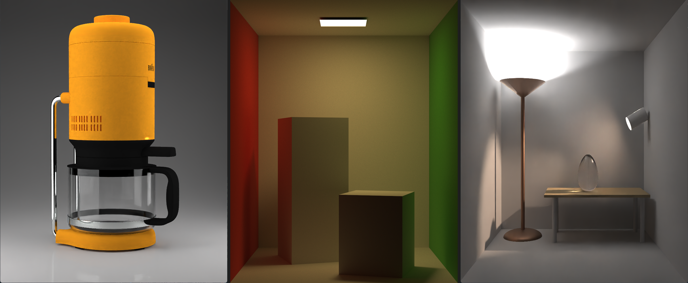

# Ray Tracer

## About

This project is a CPU-based physically-based ray tracer built from scratch, implementing several global illumination techniques to achieve realistic image synthesis. It features:

- Path Tracing with Monte Carlo integration
- Light Tracing (reverse path tracing)
- Instant Radiosity with Virtual Point Lights (VPLs)
- Support for a variety of materials: Diffuse, Mirror, Glass, Glossy, and Plastic
- Environment Lighting using a tabulated distribution and Multiple Importance Sampling (MIS)

Optimizations for performance and quality:
- BVH (Bounding Volume Hierarchy) for fast ray-scene intersections
- Multi-threaded tile-based rendering
- Tile-based adaptive sampling for efficient resource usage
- Intel Open Image Denoiser for post-process noise reduction

The ray tracer is entirely CPU-based, focusing on clean implementation, extensibility, and high-quality offline rendering. 
It serves as both a learning project and a foundation for further experimentation in physically-based rendering.

## Instructions
Scenes are not included with this directory , you need to download scens from [Here](URL).<br>
Create a scene folder inside RayTracer directory and place scenes inside of this.

Use the belove section from ***Main.h*** file to change scenes

```cpp
// current scene number
// change this to render different scenes
const unsigned int sceneNum = 0;
```

Use belove method to change different settings of Ray Tracer

```cpp
// create settings for the ray tracer
SETTINGS createSettings()
{
	SETTINGS settings;

	settings.algorithm = AL_PATH_TRACE;
	settings.drawMode = DM_ALGORITHM;
	settings.toneMap = TM_LINEAR;
	settings.filter = FT_BOX;

	settings.canHitLight = true;
	settings.debug = false;
	settings.denoise = true;

	settings.useMultithreading = true;
	settings.useMis = true;

	settings.adaptiveSampling = true;
	settings.initSPP = 10;
	settings.totalSPP = 500;

	settings.numThreads = 20;
	settings.maxBounces = 5;
	settings.vplRaysPerTile = 1;

	return settings;
}
```



