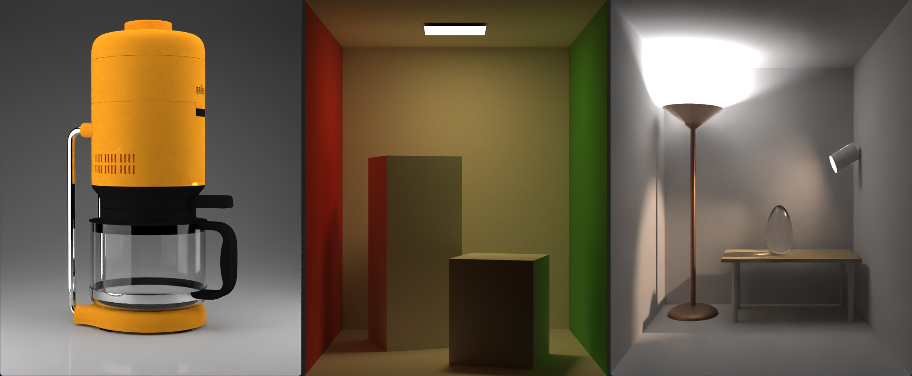

# Ray Tracer

## 📌 About

This project is a physically-based (CPU) ray tracer built upon the template provided by [MSCGamesTom](https://github.com/MSCGamesTom) for the Advanced Graphics coursework during my MSc in Games Engineering. It implements several global illumination techniques to achieve realistic image synthesis.

The ray tracer is entirely CPU-based, focusing on clean implementation, extensibility, and high-quality offline rendering. 
It serves as both a learning project and a foundation for further experimentation in physically-based rendering.



## 🚀 Features
### Algorithms
- Path Tracing ✅
- Light Tracing ✅
- Instant Radiosity ✅
- Bidirectional Path Tracing ⚠️ (In Progress)
- Progressive Photon Mapping 🔴 (Future Work)
- Metropolis Light Transport 🔴 (Future Work)

### Optimizations
- Multithreading ✅
- Acceleration Structure (Bounding Volume Hierarchy) ✅
- Tile Based Adaptive Sampling ✅
- Multiple Importance Sampling ✅
- Tabulated Distribution ✅
- Intel Open Image Denoiser ✅
- GPU Imlementation 🔴 (Future Work)

### Material Support
- Diffuse (Cosine and OrenNayar) ✅
- Mirror ✅
- Glass ✅
- Glossy (Conductor) ✅
- Plastic (Phong) ✅
- Layered 🔴 (Future Work)


## 🧾 Instructions
Scenes are not included with this directory , you need to download scens from [Here](https://github.com/RohitKaravadra/Ray-Tracer-Scenes.git).<br>
Create a scene folder inside RayTracer directory and place scenes inside of it.

You can download release version form [Here](https://github.com/RohitKaravadra/Ray-Tracer/releases) or can run the latest changes manually using visual studio if you like codding.

### Controles ⌨️
- Use _**TAB**_ to cycle through different Algorithms
- Use _**SPACE**_ to cycle through draw modes (Albedo, Normals, Light Samples)
- Use _**R**_ to toggle render

### Options ⚒️

| Option            | Description                                                                 |
|-------------------|-----------------------------------------------------------------------------|
| `-scene <path>`   | Path to the scene file **(required)**                                       |
| `-spp <int>`      | Total samples per pixel (**default:** 100, **range:** 10–100000)            |
| `-bounces <int>`  | Maximum bounces for path tracing (**default:** 5, **range:** 2–100)         |
| `-threads <int>`  | Number of threads for multithreading (**default:** 8, **range:** 1–64)      |
| `-denoise <0\|1>` | Enable denoising (**1:** enable, **0:** disable, **default:** 0)            |
| `-saveRenders <0\|1>` | Save rendered and denoised images (**1:** enable, **0:** disable, **default:** 0) |
| `-filter <0-2>`   | Image filter type (**0:** Box, **1:** Gaussian, **2:** Mitchell-Netravali; **default:** 0) |
| `-toneMap <0-4>`  | Tone mapping operator (**0:** None, **1:** Linear, **2:** Linear+Exposure, **3:** Reinhard Global, **4:** Filmic; **default:** 3) |

---

## Example

Use below command to run from terminal
```bash
RayTracer -scene "scenes/cornell-box" -spp 500 -bounces 10 -threads 4 -denoise 1 -saveRenders 1 -filter 1 -toneMap 4
```

